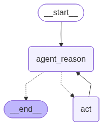

# 🌤️ Weather ×3 — Simple LangGraph App

This is a minimal **LangGraph** demo that:

1. asks an agent to **get the weather** for a city, and
2. **triples** the numeric value via a tool (e.g., temperature → temperature×3).

The graph runs a small ReAct-style loop: the agent decides whether to call tools; if a tool is called, we run it and then return to the agent to finalize the answer.

---

## 🧭 How it works

- **State schema**: `MessagesState` (a list of chat messages).
- **Nodes**
  - `AGENT_REASON` → `run_agent_reasoning(state)`  
    The LLM reasons about the user question and decides whether to call tools (weather + triple).
  - `ACT` → `tool_node(state)`  
    Executes requested tool calls, appends their results as `ToolMessage`s to the state.
- **Control flow**
  - If the latest AI message includes **no tool calls** → **END**.
  - If there **are** tool calls → go to **ACT**, then loop back to **AGENT_REASON**.

```python
# Pseudocode of the routing condition
def should_continue(state):
    if not state["messages"][-1].tool_calls:
        return END
    return ACT
```

---

## 🗂️ Files

- `main.py` — builds the graph and runs a sample query (“weather in Coimbatore … then triple it”).
- `nodes.py` — implements `run_agent_reasoning` (the agent) and `tool_node` (executes tools).
- `graph.png` — auto-generated diagram of the compiled graph.

The code also saves a Mermaid-rendered PNG of the graph:

```
app.get_graph().draw_mermaid_png(output_file_path="graph.png")
```

---

## 🔧 Requirements

- Python 3.10+
- `langgraph`
- `langchain` / `langchain-core`
- `python-dotenv`
- A weather tool implementation (inside `nodes.py`) and a **triple** tool/function.

Example `requirements.txt` (adjust as needed):

```txt
langgraph>=0.2.0
langchain>=0.2.0
python-dotenv>=1.0.1
```

> If your weather tool hits an external API, also install its SDK or use `requests` and set the required API keys in `.env`.

---

## ⚙️ Setup

1. Install dependencies:

```bash
pip install -r requirements.txt
```

2. (Optional) Create a `.env` with any API keys your weather tool needs:

```env
WEATHER_API_KEY=your_key_here
```

3. Run:

```bash
python main.py
```

You should see:

- “Hello ReAct with LangGraph” in the console
- The final assistant message printed
- `graph.png` created in the project directory

---

## 🖼️ Graph

The compiled graph is a simple loop:

```mermaid
flowchart TD
    A[AGENT_REASON] -->|tool_calls?| B{Has tool calls?}
    B -- No --> END
    B -- Yes --> C[ACT (tool_node)]
    C --> A
```

And the PNG is saved as:  


---

## 🧪 Example Prompt

> `what is the weather in Coimbatore? List it and then Triple it`

The agent should fetch weather data via the weather tool, then call the **triple** tool on the numeric values (e.g., temperatures), and finally summarize the result.

---

## ❓ Troubleshooting

- **No tool calls**: Ensure your `run_agent_reasoning` is configured for tool-calling (model + prompt format).
- **Tool errors**: Verify the `tool_node` correctly maps tool names to implementations (weather + triple).
- **API issues**: Check `.env` keys and network access if your weather tool uses an external API.

---

Made with ❤️ using LangGraph.
